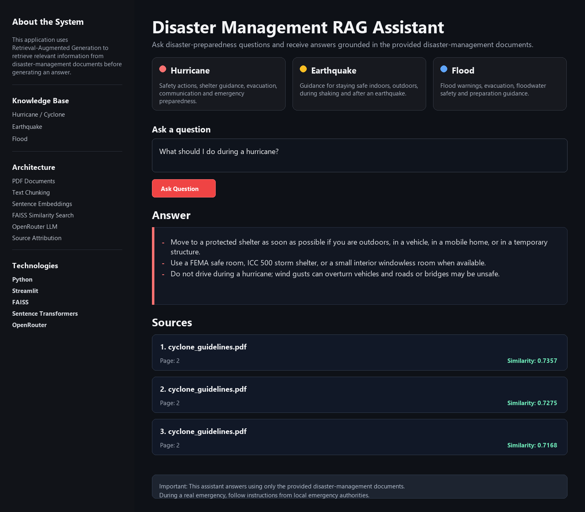
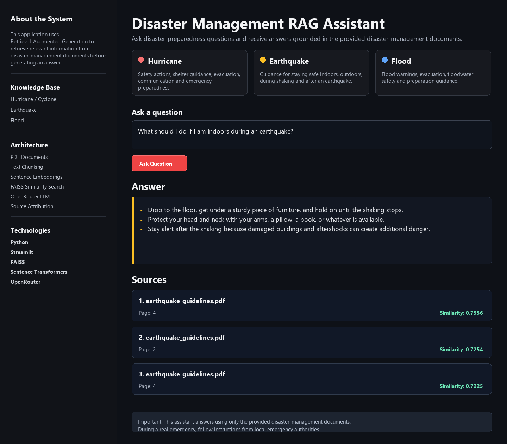
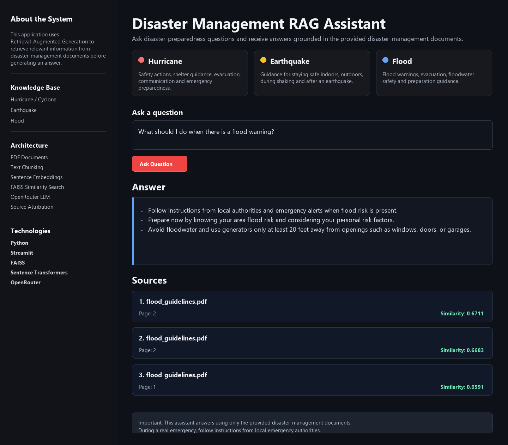
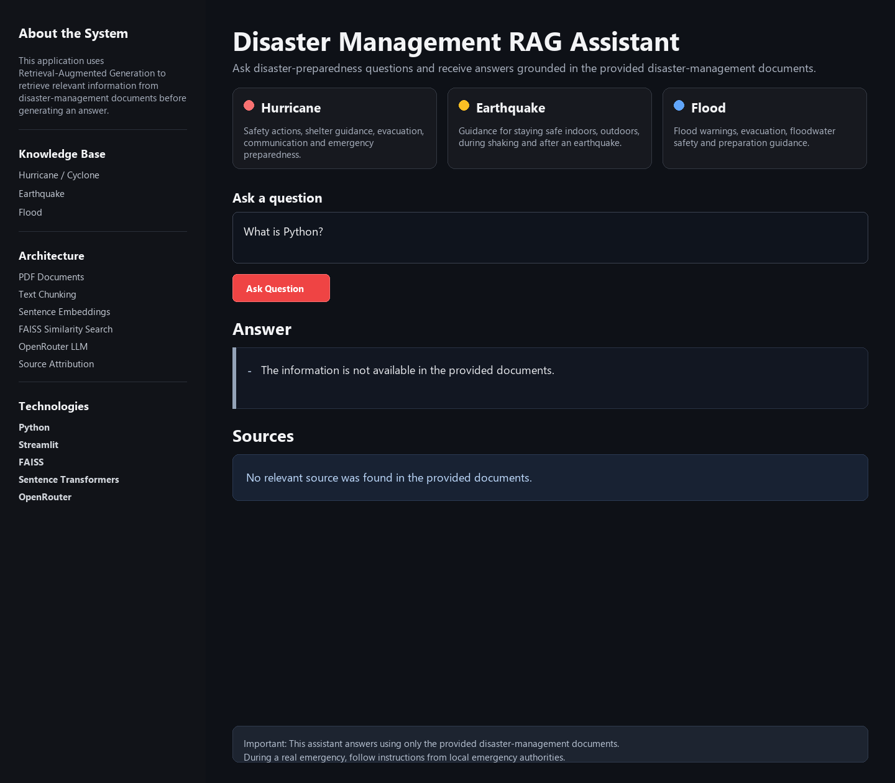

#  Resilience RAG Assistant

A Streamlit-based **Disaster Management Retrieval-Augmented Generation (RAG) Assistant** that answers questions using information retrieved from the provided **cyclone, earthquake, and flood guideline documents**.

The system combines:

* **PDF document processing**
* **Text chunking**
* **Sentence Transformers**
* **FAISS vector similarity search**
* **OpenRouter LLM**
* **Retrieval-Augmented Generation**
* **Source attribution**
* **Similarity threshold filtering**
* **Streamlit web interface**

The main goal is to provide answers that are **grounded in the provided disaster-management documents rather than relying on unsupported external information**.

---

## 📌 Project Overview

The Resilience RAG Assistant allows a user to ask questions such as:

* What should I do during a hurricane?
* What should I do during an earthquake?
* What should I do when there is a flood warning?

The application searches the provided disaster-management documents for relevant information and then passes the retrieved content to an LLM.

The generated answer is therefore based on the retrieved document context.

If the user's question is unrelated to the available documents, the system does not generate an unsupported answer.

For example:

> **Question:** What is the capital of France?

The application responds:

> The information is not available in the provided documents.

---

# 🧠 What is RAG?

**RAG stands for Retrieval-Augmented Generation.**

Instead of allowing an LLM to answer a question entirely from its pretrained knowledge, the system first retrieves relevant information from a specific knowledge base.

The process is:

```text
User Question
      ↓
Question Embedding
      ↓
FAISS Similarity Search
      ↓
Relevant Document Chunks
      ↓
Similarity Threshold Filtering
      ↓
Retrieved Context
      ↓
OpenRouter LLM
      ↓
Grounded Answer
      ↓
Source Attribution
```

This approach helps the application keep its answers connected to the provided documents.

---

# 🏗️ System Architecture

```text
                 ┌─────────────────────┐
                 │     User Question   │
                 └──────────┬──────────┘
                            │
                            ▼
                 ┌─────────────────────┐
                 │     Streamlit UI    │
                 └──────────┬──────────┘
                            │
                            ▼
                 ┌─────────────────────┐
                 │ Sentence Transformer│
                 │ all-MiniLM-L6-v2    │
                 └──────────┬──────────┘
                            │
                            ▼
                 ┌─────────────────────┐
                 │   Query Embedding   │
                 └──────────┬──────────┘
                            │
                            ▼
                 ┌─────────────────────┐
                 │   FAISS Search      │
                 │ Cosine Similarity   │
                 └──────────┬──────────┘
                            │
                            ▼
                 ┌─────────────────────┐
                 │ Similarity Threshold│
                 │       0.30          │
                 └──────────┬──────────┘
                            │
                            ▼
                 ┌─────────────────────┐
                 │ Relevant Chunks     │
                 │      Top 3          │
                 └──────────┬──────────┘
                            │
                            ▼
                 ┌─────────────────────┐
                 │ Context Construction│
                 └──────────┬──────────┘
                            │
                            ▼
                 ┌─────────────────────┐
                 │   OpenRouter LLM    │
                 └──────────┬──────────┘
                            │
                            ▼
                 ┌─────────────────────┐
                 │    Final Answer     │
                 └──────────┬──────────┘
                            │
                            ▼
                 ┌─────────────────────┐
                 │ Source Attribution  │
                 │ PDF + Page + Score  │
                 └─────────────────────┘
```

---

# 📚 Knowledge Base

The application currently uses three disaster-management PDF documents:

### 🌪️ Cyclone / Hurricane

Contains guidance related to:

* Safe shelter
* Emergency communication
* Evacuation
* Severe wind safety
* Floodwater safety
* Generator safety
* Emergency preparedness

### 🌎 Earthquake

Contains guidance related to:

* Indoor earthquake safety
* Outdoor earthquake safety
* Vehicle safety
* Protection from falling objects
* Being trapped under debris
* Actions after shaking
* Family preparedness

### 🌊 Flood

Contains guidance related to:

* Flood warnings
* Evacuation
* Moving to higher ground
* Floodwater safety
* Communication
* Flood preparation
* Post-flood actions

---

# 🔧 Technologies Used

| Technology            | Purpose                                |
| --------------------- | -------------------------------------- |
| Python                | Main programming language              |
| Streamlit             | Web application and user interface     |
| PyMuPDF               | PDF document text extraction           |
| Sentence Transformers | Convert text into numerical embeddings |
| `all-MiniLM-L6-v2`    | Sentence embedding model               |
| FAISS                 | Vector similarity search               |
| NumPy                 | Numerical/vector operations            |
| OpenRouter            | LLM API                                |
| OpenAI Python SDK     | Communication with OpenRouter          |
| python-dotenv         | Loading API keys from `.env`           |

---

# 🔍 Why Each Technology Is Used

## 1. Python

Python is used as the main programming language because it provides libraries for:

* Document processing
* Machine learning
* Embeddings
* Vector search
* API integration
* Web application development

---

## 2. Streamlit

Streamlit is used to create the user interface.

It provides:

* Question input
* Ask Question button
* Answer display
* Source display
* Disaster information cards
* System architecture information
* Safety disclaimer

This allows the RAG system to be demonstrated through a web interface rather than only through the terminal.

---

## 3. PDF Processing

The disaster guidelines are provided as PDF documents.

The document loader extracts text from these PDFs so that the content can be processed by the RAG pipeline.

The extracted information contains metadata such as:

```text
Source
Page
Text
```

This metadata is later used for source attribution.

---

## 4. Text Chunking

Large documents are divided into smaller text chunks.

Instead of embedding an entire PDF as one large piece of text, the application creates smaller searchable sections.

This makes it easier to retrieve the specific part of a document that is relevant to a user's question.

The project currently creates **41 chunks** from the provided documents.

---

## 5. Sentence Transformers

The project uses the embedding model:

```text
all-MiniLM-L6-v2
```

The model converts text into numerical vectors.

For example:

```text
"What should I do during a hurricane?"
```

is converted into a vector representation.

The same process is applied to the document chunks.

This allows the system to compare the semantic meaning of the question with the semantic meaning of the document chunks.

---

## 6. FAISS

FAISS is used as the vector database/search engine.

The project uses an inner-product index with normalized embeddings.

Because the embeddings are normalized, inner product behaves as cosine similarity for the retrieval process.

The vector store contains:

```text
41 vectors
```

with an embedding dimension of:

```text
384
```

FAISS then retrieves the most relevant chunks for a user's question.

---

## 7. Similarity Threshold

The application uses:

```text
MIN_SIMILARITY = 0.30
```

This threshold helps prevent weakly related document chunks from being treated as relevant evidence.

If a retrieved result has a similarity score below the threshold, it is ignored.

For example, an unrelated question such as:

```text
What is the capital of France?
```

does not retrieve sufficiently relevant disaster-management information.

The system therefore returns:

```text
The information is not available in the provided documents.
```

---

## 8. OpenRouter

OpenRouter is used to provide access to the LLM used for answer generation.

The application sends:

```text
User Question
+
Retrieved Document Context
```

to the LLM.

The model is instructed to answer only from the retrieved context.

The configured model is:

```text
openrouter/free
```

---

## 9. Prompt Grounding

The RAG pipeline uses a system prompt that instructs the LLM to:

1. Use only the retrieved document context.
2. Avoid inventing information.
3. Avoid outside knowledge.
4. Return a fixed response when the information is unavailable.
5. Provide clear and practical answers.
6. Use numbered or bullet-point formatting when appropriate.

This is an important part of preventing unsupported answers.

---

# 📊 Retrieval Process

For every question, the system performs the following steps:

### Step 1 — Receive the question

Example:

```text
What should I do during an earthquake?
```

### Step 2 — Create an embedding

The question is converted into a 384-dimensional vector using:

```text
all-MiniLM-L6-v2
```

### Step 3 — Search FAISS

The question vector is compared against the stored document vectors.

### Step 4 — Retrieve Top 3

The system retrieves the three highest-scoring chunks.

### Step 5 — Apply similarity threshold

Results below:

```text
0.30
```

are removed.

### Step 6 — Build context

The remaining chunks are combined into the context supplied to the LLM.

### Step 7 — Generate answer

OpenRouter generates an answer using only the retrieved context.

### Step 8 — Display sources

The UI displays:

```text
Source PDF
Page number
Similarity score
```

This provides transparency about where the answer came from.

---

# 📁 Project Structure

```text
RESILIENCE-RAG-ASSISTANT/
│
├── data/
│   ├── documents/
│   │   ├── cyclone_guidelines.pdf
│   │   ├── earthquake_guidelines.pdf
│   │   └── flood_guidelines.pdf
│   │
│   └── vector_store/
│       ├── chunks.json
│       └── disaster_guidelines.index
│
├── evaluation/
│   └── sample_questions.json
│
├── screenshots/
│   ├── hurricane.png
│   ├── earthquake.png
│   ├── flood.png
│   └── out_of_scope.png
│
├── src/
│   ├── __init__.py
│   ├── chunking.py
│   ├── document_loader.py
│   ├── embeddings.py
│   ├── openrouter_test.py
│   ├── rag_pipeline.py
│   └── retrieval.py
│
├── app.py
├── README.md
├── requirements.txt
└── .gitignore
```

---

# 🚀 Installation

Clone the repository:

```bash
git clone <YOUR_GITHUB_REPOSITORY_URL>
cd resilience-rag-assistant
```

Create and activate a virtual environment:

### Windows

```powershell
python -m venv venv
venv\Scripts\activate
```

Install the required packages:

```powershell
pip install -r requirements.txt
```

Verify the installation:

```powershell
pip check
```

The expected result is:

```text
No broken requirements found.
```

---

# 🔑 Environment Configuration

Create a `.env` file in the project root.

```env
OPENROUTER_API_KEY=your_openrouter_api_key
```

Replace the value with your own OpenRouter API key.

### ⚠️ Security

The `.env` file must **not** be committed to GitHub.

The repository `.gitignore` should contain:

```text
.env
venv/
__pycache__/
*.pyc
```

Never expose the actual API key in:

* Source code
* README
* Screenshots
* GitHub
* Project ZIP

---

# ▶️ Running the Application

After activating the virtual environment and configuring the API key:

```powershell
streamlit run app.py
```

Streamlit will start the application locally.

Open the displayed local URL in a browser.

---

# 🧪 Example Questions

### Hurricane

```text
What should I do during a hurricane?
```

### Earthquake

```text
What should I do during an earthquake?
```

### Flood

```text
What should I do when there is a flood warning?
```

### Out-of-Scope Test

```text
What is the capital of France?
```

The expected behavior for an out-of-scope question is:

```text
The information is not available in the provided documents.
```

---

# 📸 Screenshots

## Hurricane / Cyclone Question

The system retrieves cyclone-related information and generates a grounded answer with source attribution.



---

## Earthquake Question

The system retrieves earthquake-related information and displays the relevant PDF and similarity score.



---

## Flood Question

The system retrieves flood-related information from the flood guideline document.



---

## Out-of-Scope Question

The system does not provide an unsupported answer when the information cannot be found in the knowledge base.



---

# ✅ Evaluation

The system was tested with questions covering all three disaster categories:

| Category     | Test                                            | Result               |
| ------------ | ----------------------------------------------- | -------------------- |
| Hurricane    | What should I do during a hurricane?            | ✅ Relevant answer    |
| Earthquake   | What should I do during an earthquake?          | ✅ Relevant answer    |
| Flood        | What should I do when there is a flood warning? | ✅ Relevant answer    |
| Out-of-scope | What is the capital of France?                  | ✅ Correctly rejected |

The application also displays retrieved source documents, page numbers, and similarity scores.

---

# 🛡️ Safety and Grounding

This application is designed as a demonstration of document-grounded RAG.

It answers questions using the provided disaster-management documents and should not replace instructions from emergency authorities during an actual disaster.

The application intentionally avoids providing unsupported information when relevant information cannot be found in the knowledge base.

---

# 🎯 Key Features

* 📄 PDF-based knowledge base
* ✂️ Text chunking
* 🧠 Semantic sentence embeddings
* 🔎 FAISS vector similarity search
* 🎯 Similarity threshold filtering
* 🤖 OpenRouter LLM integration
* 📚 Source attribution
* 📄 Page-level references
* 🛡️ Out-of-scope question handling
* 🖥️ Streamlit web interface
* ⚡ Cached RAG assistant initialization
* 🔐 Environment-variable API key management

---

# 🔮 Possible Future Improvements

Future versions could include:

* Support for additional disaster types
* More extensive evaluation datasets
* Automatic document ingestion
* Conversation history
* Multilingual disaster guidance
* Better retrieval ranking
* Hybrid keyword + semantic search
* Reranking models
* Streaming LLM responses
* Document upload through the UI
* Automated evaluation metrics

---

# 👨‍💻 Author

**Nitheesh H D**

Built as a Retrieval-Augmented Generation project for disaster-management information retrieval and question answering.
